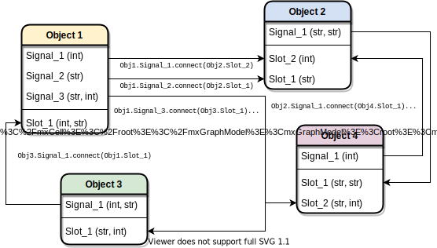

# [pyTermTk](https://github.com/ceccopierangiolieugenio/pyTermTk) - Signal & Slots

Signals and slots are used for communication between objects.

## Intro
The [TermTk Signal&Slots](https://ceccopierangiolieugenio.github.io/pyTermTk/TTkCore/signal.html) is more than heavily inspired by [Qt5 Signal&Slots](https://www.riverbankcomputing.com/static/Docs/PyQt5/signals_slots.html)
https://doc.qt.io/qt-5/signalsandslots.html

In GUI programming, when we change one widget, we often want another widget to be notified. More generally, we want objects of any kind to be able to communicate with one another. For example, if a user clicks a Close button, we probably want the window's close() function to be called.

## Signal and Slots

A signal is emitted when a particular event occurs. <br/>
A slot is a function that is called in response to a particular signal. <br/>
[TermTk](https://github.com/ceccopierangiolieugenio/pyTermTk)'s [widgets](https://ceccopierangiolieugenio.github.io/pyTermTk/autogen.TermTk/TermTk.TTkWidgets.html) have many predefined signals/slots, but it is possible to subclass any [widgets](https://ceccopierangiolieugenio.github.io/pyTermTk/autogen.TermTk/TermTk.TTkWidgets.html) and add our own signals/slots to them.



## Example 1 - basic signal slots
From [example1.basic.signalslots.py](signalslots/example1.basic.signalslots.py)
```python
import TermTk as ttk

ttk.TTkLog.use_default_stdout_logging()

    # define 2 signals with different signatures
signal = ttk.pyTTkSignal()
otherSignal = ttk.pyTTkSignal(int)


    # Define a slot with no input as signature
@ttk.pyTTkSlot()
def slot():
    ttk.TTkLog.debug("Received a simple signal")

    # Define 2 slots with "int" as input signature
@ttk.pyTTkSlot(int)
def otherSlot(val):
    ttk.TTkLog.debug(f"[otherSlot] Received a valued signal, val:{val}")

@ttk.pyTTkSlot(int)
def anotherSlot(val):
    ttk.TTkLog.debug(f"[anootherSlot] Received a valued signal, val:{val}")


    # connect the signals to the proper slot
signal.connect(slot)
otherSignal.connect(otherSlot)
otherSignal.connect(anotherSlot)

    # Test the signals
ttk.TTkLog.debug("Emit a simple signal")
signal.emit()
ttk.TTkLog.debug("Emit a valued signal")
otherSignal.emit(123)
```
The above code produces the following output

```text
 $  tutorial/signalslots/example1.basic.signalslots.py
DEBUG:(MainThread) tutorial/signalslots/example1.basic.signalslots.py:54 Emit a simple signal
DEBUG:(MainThread) tutorial/signalslots/example1.basic.signalslots.py:37 Received a simple signal
DEBUG:(MainThread) tutorial/signalslots/example1.basic.signalslots.py:56 Emit a valued signal
DEBUG:(MainThread) tutorial/signalslots/example1.basic.signalslots.py:42 [otherSlot] Received a valued signal, val:123
DEBUG:(MainThread) tutorial/signalslots/example1.basic.signalslots.py:45 [anootherSlot] Received a valued signal, val:123
```

## Example 2 - Use widgets signals and slots
From [example2.widgets.signalslots.py](signalslots/example2.widgets.signalslots.py)
```python
import TermTk as ttk

root = ttk.TTk()

    # Create a window with a logviewer
logWin = ttk.TTkWindow(parent=root,pos = (10,2), size=(80,20), title="LogViewer Window", border=True, layout=ttk.TTkVBoxLayout())
ttk.TTkLogViewer(parent=logWin)

    # Create 2 buttons
btnShow = ttk.TTkButton(parent=root, text="Show", pos=(0,0), size=(10,3), border=True)
btnHide = ttk.TTkButton(parent=root, text="Hide", pos=(0,3), size=(10,3), border=True)

    # Connect the btnShow's "clicked" signal with the window's "show" slot
btnShow.clicked.connect(logWin.show)
    # Connect the btnHide's "clicked" signal with the window's "hide" slot
btnHide.clicked.connect(logWin.hide)

root.mainloop()
```
It is totally useless for this example but the above code produces the following output

```text
┌────────┐
│  Show  │
╘════════╛╔══════════════════════════════════════════════════════════════════════════════╗
┌────────┐║ LogViewer Window                                                             ║
│  Hide  │╟──────────────────────────────────────────────────────────────────────────────╢
╘════════╛║                                                                              ║
          ║DEBUG: _/.venv/lib/python3.8/site-packages/TermTk/TTkCore/ttk.py:70 Starting M║
          ║DEBUG: _/.venv/lib/python3.8/site-packages/TermTk/TTkCore/ttk.py:80 Signal Eve║
          ║DEBUG: _/.venv/lib/python3.8/site-packages/TermTk/TTkCore/ttk.py:65 fps: 33   ║
          ║DEBUG: _/.venv/lib/python3.8/site-packages/TermTk/TTkCore/ttk.py:65 fps: 34   ║
          ║DEBUG: _/.venv/lib/python3.8/site-packages/TermTk/TTkCore/ttk.py:65 fps: 34   ║
          ║                                                                              ║
          ║                                                                              ║
          ║                                                                              ║
          ║                                                                              ║
          ║                                                                              ║
          ║                                                                              ║
          ║                                                                              ║
          ║                                                                              ║
          ║                                                                              ║
          ║◀▓▓▓▓▓▓▓▓▓▓▓▓▓▓▓▓▓▓▓▓▓▓▓▓▓▓▓▓▓▓▓▓▓▓▓▓▓▓▓▓▓▓▓▓▓▓▓▓▓▓▓▓▓▓▓▓▓▓▓▓▓▓▓▓▓┄┄┄┄┄┄┄┄┄┄┄▶║
          ╚══════════════════════════════════════════════════════════════════════════════╝
```